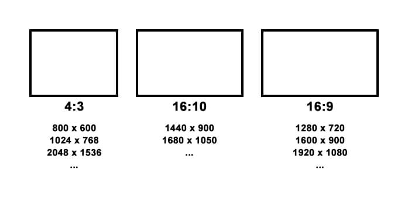
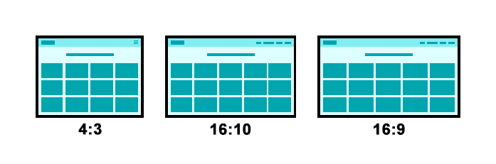
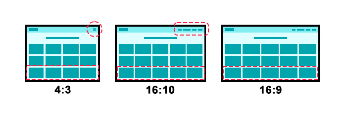
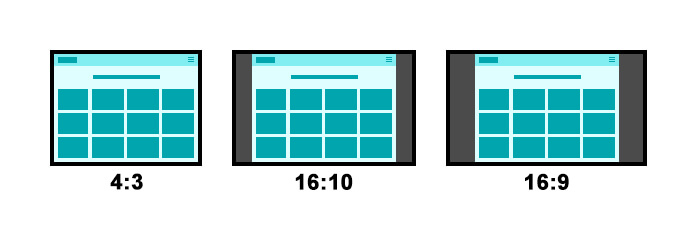
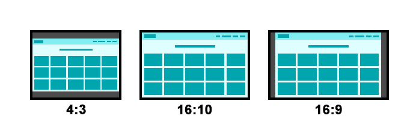

# Documentação - Tabmedia & EMS

---

# Produzindo layouts para clientes que possuem tablets com diferentes proporções de tela

Para entendermos melhor, tanto o problema quanto a solução, precisamos entender o básico dos conceitos abaixo, sendo os três últimos possíveis soluções a serem adotadas:

-   Proporção de tela
-   Resolução de tela
-   Design Responsivo
-   Design Adaptativo
-   Uma terceira maneira

### Proporção de tela

É a relação entre a largura e a altura da tela do tablet. Quando nos deparamos com telas de tablets mais quadradas e outras mais retangulares, estamos visualizando proporções diferentes. Abaixo temos uma imagem que irá mostrar estas diferentes proporções e algumas informações técnicas importantes complementando. É importante pontuar que não existem somente estas dimensões e nem somente estas proporções de tela, mas estas mostradas são algumas que vimos com frequência em tablets.

### Resolução de tela

É a quantidade de pixels que compõem a tela. Podemos ter uma tela com 9,7 polegadas de tamanho e de proporção 4:3, e neste mesmo tamanho e proporção de tela ter uma resolução de 1024x768, ou de 2048x1536. É importante dizer que, quanto maior a resolução mais detalhada ficará a imagem em tela. Existem nomenclaturas que resumem o conceito Resolução de tela e que são utilizadas em vídeos (por exemplo: 720p, 1080i ou 1080p, …) e também em televisores (por exemplo: HD, Full HD, 4K, …).

### Design Responsivo

Por meio de código é possível criarmos um layout que irá levar em consideração a relação entre, tamanho, proporção e resolução de tela. Possibilitando que este layout seja visualizada em qualquer tela de qualquer dispositivo. Este conceito é muito utilizado em sites e apps, caso seja necessário implementar o Design Responsivo, é importante aplica-lo tanto na criação quanto na programação de seu layout.

> Na primeira imagem temos três telas, cada uma de uma proporções diferente todas estão acessando o mesmo site. Na segunda imagem temos as mesmas três telas, acessando o mesmo site e com diferenças destacadas. Há destaques no menu, pois conforme o tamanho de tela o menu pode não caber, e se tronar um botão que ao ser clicado irá aparecer por cima da tela, se tornando assim um menu retrátil. Nas linhas circuladas, observamos a adição de uma coluna ou seja, os objetos foram distribuídos conforme o tamanho de tela. E essa é a função do design responsivo, é adaptar o layout conforme a proporção, tamanho e resolução da tela, ocorrendo uma nova diagramação deste layout.

### Design Adaptativo

A diferença aqui é que, com Design Adaptativo, você irá criar um layout de uma única proporção, com um limite de tamanho e de resolução. E utilizando a programação, adaptar o layout conforme a o tamanho e a resolução da tela. Apesar, dessa forma limitar mais o layout de se adaptar a tela, a vantagem é que para se fazer isso, leva-se muito menos tempo, e consequentemente acaba sendo muito menos custoso.

> Aqui usamos dois exemplos, na primeira imagem o layout se mantem na proporção 4:3, já na segunda imagem a proporção mantida é a 16:10. Perceba que temos que fixar em uma proporção, e quando o layout é aberto em outras proporções são criados vazios em cima e em baixo, ou nas laterais, esquerda e direita. Estes espaços sobrando em tela podem ser preenchido, com cor, degrade, imagem e etc. Porem não fará parte do layout.

### Uma terceira maneira

Há uma terceira forma que faz uso de parte do conceito de Design Adaptativo. Porem esta forma distorce o layout, deixando imagens e textos esticados ou encolhidos. O benefício é que toda a tela é preenchida, não deixando espaços em cima, em baixo, ou nas laterais. Assim como no Design Adaptativo, uma proporção é escolhida, o layout é feito nela e por meio de programação podemos esticar este layout para que caiba em tela.

## Conclusão e códigos de auxílios

Para os Visual Aid, recomendamos normalmente a implementação do Design Adaptativo, devido a questões como:

-   Performance
-   Agilidade na criação dos layouts
-   Agilidade na programação dos layouts elaborados
-   Facilidades geradas para a manutenção e atualização do Visual Aid
-   Facilidades geradas para subir os arquivos
-   Possibilidades de melhores animações e interações
-   Valor mais acessível

Abaixo iremos disponibilizar três pacotes de códigos sendo o primeiro um exemplo de Design Responsivo, e segundo um exemplo de Design Adaptativo e um terceiro será “A terceira maneira” que faz uso do Design Adaptativo, porem estica o layout para o tamanho da tela.

-   Exemplo de Design Responsivo
-   Exemplo de Design Adaptativo criando bordas
-   Exemplo de Design Adaptativo esticando o layout

> Matéria escrita por Rafael Nascimento, CEO e CTO da Rihz Tech em parceria com a Tabmedia.
